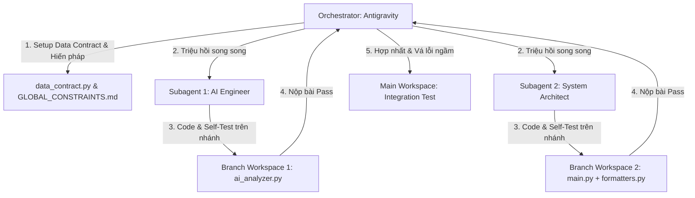

# Nhật Ký Hoạt Động Multi-Agent (Multi-Agent Activity Log)

- **Phiên Làm Việc:** Phase 13 - Nâng cấp Kiến trúc Kháng lỗi cho `bot_app`
- **Thời gian:** 25/06/2026
- **Điều phối chính (Orchestrator):** Antigravity (Gemini 3.5 Flash)

Bản nhật ký này ghi lại chi tiết quá trình làm việc, phân bổ tác vụ và tự kiểm thử của nhóm tác tử thông minh (Multi-Agent Team) trong đợt tái cấu trúc hệ thống.

---

## 1. Bản Đồ Phân Phối Tác Vụ (Task Delegation Map)

---

## 2. Nhật Ký Chi Tiết Của Các Tác Tử

### 2.1. Điều Phối Viên Chính (Orchestrator)
- **Tác vụ khởi tạo:**
  - Khởi tạo ban đầu `data_contract.py` nhưng sau đó đã xóa bỏ sau đợt rà soát cuối do là dead code chưa dùng tới.
  - Ban hành hiến pháp `GLOBAL_CONSTRAINTS.md` ràng buộc kiến trúc.
  - Dọn dẹp lệnh `pause` ở các file `.bat` để chống treo tiến trình.
- **Tác vụ tích hợp:**
  - Nhận code bàn giao từ 2 Subagents, thực hiện copy các file từ worktrees rẽ nhánh (branch) về thư mục chính `bot_app/`.
  - Thực hiện chạy test tích hợp toàn diện.
  - **Phát hiện bug của Agent:** Phát hiện lỗi substring so khớp `"503" in err_str` bị dính bẫy khi thông báo lỗi 429 trả về chuỗi mili-giây chứa số 503 (`17.844805033s`).
  - **Vá lỗi:** Thay thế bằng cơ chế bắt lỗi chính xác `"UNAVAILABLE"` và `"RESOURCE_EXHAUSTED"` cho cả phân tích riêng lẻ (`analyze_scorecards`) và phân tích tổng quan (`analyze_overall_market`).
  - **Bảo mật môi trường:** Xác minh và cấu hình thành công `.gitignore` để không rò rỉ file `.env` lên git.
  - Tích hợp `dotenv` vào `config.py` để tự động nạp cấu hình `.env` cho Task Scheduler.

---

### 2.2. Subagent 1: AI Engineer
- **Conversation ID:** `d98eee2e-ecce-429a-b0e0-2498b46e8490`
- **Workspace:** `subagent-AI-Engineer-self-12aff1cb` (Rẽ nhánh độc lập)
- **Nhiệm vụ được giao:**
  - Cải tiến `ai_analyzer.py` kháng lỗi: thêm vòng lặp 3-retry.
  - Thiết lập xoay vòng API Keys (`config.GEMINI_API_KEYS`).
  - Thiết lập Fallback Model lùi về `gemini-2.5-flash` khi gặp lỗi 503.
- **Hoạt động tự kiểm thử (Shift-Left Testing):**
  - Viết file test mock `scratch/test_ai_fallback.py`.
  - Sử dụng `unittest.mock` để giả lập mã phản hồi 503 và 429 của Google.
  - Chạy test trên Terminal nhánh, gỡ lỗi và tự xác nhận kết quả **Pass** trước khi báo cáo hoàn thành.

---

### 2.3. Subagent 2: System Architect
- **Conversation ID:** `8600b5be-afa9-4f8e-82c9-b275ea4f2554`
- **Workspace:** `subagent-System-Architect-self-a3da5aa3` (Rẽ nhánh độc lập)
- **Nhiệm vụ được giao:**
  - Giải quyết God Object ở `main.py` và `telegram_bot.py`.
  - Chuyển `escape_ai_text()`, `format_scorecard_message()` sang module mới `formatters.py`.
  - Bọc `run_cycle()` trong `try...finally` để thực thi Atomic Caching.
- **Hoạt động tự kiểm thử (Shift-Left Testing):**
  - Viết file test mock `scratch/test_main_crash.py`.
  - Giả lập tiến trình bị crash đột ngột ở giữa chu kỳ và kiểm tra sự tồn tại của file lưu cache `.alert_cache`.
  - Chạy test trên Terminal nhánh, gỡ lỗi và tự xác nhận kết quả **Pass** trước khi báo cáo hoàn thành.

---

## 3. Nhật Ký Kiểm Thử Tích Hợp (Orchestrator Integration Test)

- **Lần chạy 1 (Chu kỳ 408 - FULL REPORT):**
  - Kích hoạt nạp biến từ `.env`.
  - Thử nghiệm gọi API thành công:
    - Mã HPG: dính lỗi 503 -> Fallback về `gemini-2.5-flash` thành công.
    - Mã VND: dính lỗi 429 -> **Bẫy substring bug xuất hiện** -> Hệ thống nhảy nhầm vào luồng 503 (nhưng vẫn tự cứu hộ thành công).
    - Bản tin tổng quan: dính lỗi 503 -> Fallback thành công.
  - Gửi Telegram: Thành công gửi đi cả 3 bản tin lớn.
- **Lần chạy 2 (Sau khi Vá lỗi Substring & Reset Chu kỳ 408):**
  - Thử nghiệm gọi API thành công:
    - Mã HPG: 503 -> Fallback thành công.
    - Mã VND: 503 -> Fallback thành công (Bản vá hoạt động tốt, nhận diện đúng lỗi 503, không còn bị nhầm lẫn từ 429).
    - Bản tin tổng quan: 503 -> Fallback thành công.
  - Gửi Telegram: Thành công gửi đi cả 3 bản tin lớn.
  - **Kết quả:** **ĐẠT TIÊU CHUẨN VẬN HÀNH (PRODUCTION-READY).**
