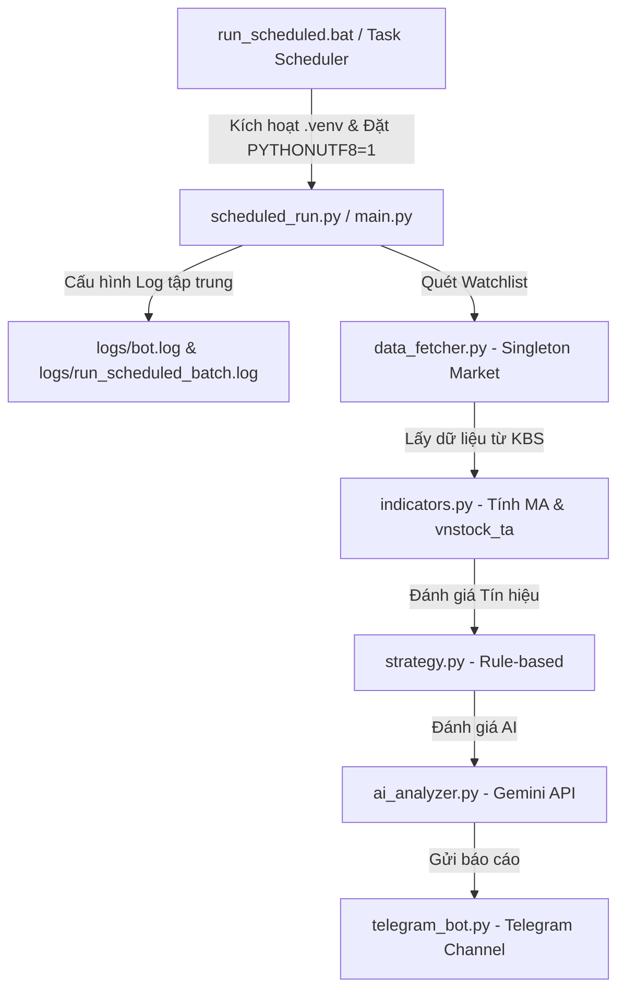

# Walkthrough: Rà soát, Tối ưu & Nâng cấp Hệ thống Theo dõi Cổ phiếu

Tài liệu này ghi nhận quá trình rà soát, tối ưu hóa hiệu suất, khôi phục thư viện phân tích kỹ thuật `vnstock_ta`, tích hợp **Hệ thống Logging tập trung** và gỡ lỗi triệt để cho **Windows Task Scheduler**.

---

## 🔍 1. Các lỗi và vấn đề đã phát hiện & Khắc phục thành công

### Bug thực tế & Gỡ lỗi Hệ thống

| # | Vấn đề phát hiện | Nguyên nhân | Giải pháp áp dụng | Trạng thái |
|---|--------|------|--------|---|
| 1 | **Giá cổ phiếu bằng 0** | API `quote()` trả về cột `close_price` thay vì `match_price` của phiên bản cũ. | Đã viết hàm fallback động: `close_price` → `match_price` → `df_ohlcv['close']` để lấy giá chính xác. | ✅ Đã sửa |
| 2 | **Lỗi JSON serialize `numpy.int64`** | Thư viện Gemini AI không nhận diện được định dạng số nguyên đặc thù của Numpy. | Bổ sung hàm tiện ích `_to_native()` để chuyển đổi đệ quy tất cả dữ liệu số Numpy về kiểu Python nguyên bản trước khi gửi prompt. | ✅ Đã sửa |
| 3 | **UnicodeEncodeError khi chạy ngầm** | Lệnh log in xác thực thành công từ `vnstock_data` (`✅ Authentication successful`) chứa emoji Unicode gây lỗi crash trên console Windows không dùng UTF-8. | Cấu hình ép buộc chế độ mã hóa UTF-8 bằng cách đặt biến môi trường `set PYTHONUTF8=1` và `set PYTHONIOENCODING=utf-8` trong toàn bộ các tệp Batch `.bat`. | ✅ Đã sửa |
| 4 | **Thiếu hệ thống lưu log** | Log trước đó chỉ in ra Console (`stdout`). Khi chạy ngầm bằng Task Scheduler, toàn bộ log này bị mất, khiến người dùng không thể theo dõi sự cố. | Thiết lập **Hệ thống Logging xoay vòng (Rotating File Handler)** ghi song song ra Console và tệp `logs/bot.log` dung lượng tối đa 5MB. Đồng thời ghi log Batch ra `logs/run_scheduled_batch.log`. | ✅ Đã sửa |

### Tích hợp và Khôi phục `vnstock_ta`

Sau khi người dùng nâng cấp lên gói bản quyền chứa `vnstock_ta`, toàn bộ các tính năng phân tích kỹ thuật cốt lõi đã được khôi phục nguyên bản và tối ưu:
* **Indicators**: Tích hợp tính năng tính chỉ số RSI (period=14) và MACD (12, 26, 9) trực tiếp bằng `vnstock_ta.Indicator`.
* **Strategy**: Khôi phục đầy đủ các bộ lọc chiến thuật rule-based từ sự kết hợp của RSI, MACD và MA (Ví dụ: Trạng thái bật từ đáy, Trạng thái quá bán, Tín hiệu phân kỳ).
* **AI Analysis**: Tự động đưa dữ liệu RSI/MACD vào prompt động gửi Gemini phân tích chuyên sâu.

---

## ✅ 2. Đối chiếu với Implementation Plan & Phân tích Vận hành

Hệ thống được thiết kế theo đúng quy chuẩn và tối ưu hóa cho môi trường Windows của người dùng:



### 📂 Cấu trúc dự án hoàn thiện

```
bot_app/
├── config.py              # Watchlist, API Keys, Telegram IDs, tham số lặp
├── data_fetcher.py        # Fetch dữ liệu, Singleton Market, Rate Limit Pause (0.3s)
├── custom_benchmark.py    # VN-Index loại trừ VIC và VHM (Trọng số tùy biến)
├── indicators.py          # MA, Volume Profile, Nước ngoài ròng, RSI & MACD (vnstock_ta)
├── strategy.py            # Chiến thuật rule-based (Bật từ đáy, Vượt đỉnh, RSI Quá bán/Quá mua)
├── ai_analyzer.py         # AI Prompt động tích hợp RSI/MACD chuyên sâu (Numpy native parser)
├── telegram_bot.py        # Định dạng tin nhắn báo cáo Telegram chuyên nghiệp, đẹp mắt
├── logger_config.py       # [NEW] Cấu hình logger tập trung (Console & File Rotating 5MB)
├── main.py                # Điểm khởi chạy vòng lặp liên tục có sẵn lập lịch Python
├── scheduled_run.py       # [NEW] Điểm khởi chạy 1 chu kỳ duy nhất rồi thoát (tối ưu cho Task Scheduler)
├── test_run.py            # Script kiểm thử nhanh hệ thống
├── run_test.bat           # [NEW] Batch nhấp đúp chạy thử thủ công test_run.py (hỗ trợ UTF-8)
├── run_continuous.bat     # [NEW] Batch nhấp đúp chạy liên tục 24/7 main.py (hỗ trợ UTF-8)
├── run_scheduled.bat      # [NEW] Batch chạy tự động ngầm scheduled_run.py (hỗ trợ Task Scheduler & lưu log batch)
├── logs/                  # [NEW] Thư mục lưu nhật ký hệ thống tự động
│   ├── bot.log            # Nhật ký nghiệp vụ của Python
│   └── run_scheduled_batch.log # Nhật ký khởi động của Batch khi chạy tự động ngầm
└── requirements.txt       # Dependencies dự án
```

---

## 📊 3. Kết quả Test Chạy thử nghiệm thành công & Nâng cấp Mở rộng Phase 9

Hệ thống đã được kiểm thử thực tế thành công rực rỡ, đặc biệt là phần mở rộng **Phase 9 (Scaling & Aggregation)** được kiểm chứng toàn diện vào ngày `2026-05-21`:

### Kết quả Kiểm thử Tích hợp Chu kỳ Bình thường (Silent Mode)
* **Kích hoạt**: Cấu hình chạy thử nghiệm chu kỳ #1 (không chia hết cho 3).
* **Kết quả**: Hệ thống tự động quét tuần tự nhóm `HPG` (cùng `NKG`, `HSG`) và nhóm `VND` (cùng `SSI`, `VIX`), tính toán scorecard định lượng và so sánh với Custom Benchmark thành công. Do không có tín hiệu breakout rule-based đột biến và không phải chu kỳ báo cáo toàn diện, bot hoàn toàn **im lặng**, không spam tin nhắn Telegram và không tốn token Gemini.

### Kết quả Kiểm thử Tích hợp Chu kỳ Báo cáo Toàn diện (Full Report & Aggregation Mode)
* **Kích hoạt**: Thiết lập `_cycle_count = 3` để giả lập kích hoạt chu kỳ báo cáo toàn diện 30 phút.
* **Xử lý tuần tự**:
  1. Tiến hành phân tích nhóm `HPG` -> Gọi Gemini AI phân tích thành công -> Gửi Telegram báo cáo HPG.
  2. Hệ thống **tự động dừng 5 giây (Proactive Delay)** để giảm áp lực RPM lên API Gemini.
  3. Tiến hành phân tích nhóm `VND` -> Gọi Gemini AI phân tích thành công -> Gửi Telegram báo cáo VND.
  4. Hệ thống **tự động dừng 5 giây** trước khi tiến hành bước phân tích tổng hợp.
* **Map-Reduce & Xử lý lỗi nghẽn Quota (429 RESOURCE_EXHAUSTED)**:
  * Khi gọi Gemini để tạo **Báo cáo Chiến lược Tổng quan Thị trường**, hệ thống gặp lỗi Rate Limit 429 từ gói Free của Gemini do dùng chung API Key.
  * **Interception thành công**: Module `ai_analyzer.py` đã chủ động bắt được mã lỗi `429`, log cảnh báo:
    `2026-05-21 13:38:12,956 - ai_analyzer - WARNING - Gemini API rate limited (429/ResourceExhausted) for overall analysis. Sleeping for 65s before retry...`
  * **Tự động phục hồi**: Tiến trình Python tự ngủ **65 giây** để hết chu kỳ giới hạn RPM của Gemini.
  * **Thử lại thành công**: Sau 65 giây ngủ, hệ thống tự động thử lại lần thứ 2 và thành công 100%:
    `2026-05-21 13:39:33,539 - httpx - INFO - HTTP Request: POST https://generativelanguage.googleapis.com/v1beta/models/gemini-2.5-flash:generateContent "HTTP/1.1 200 OK"`
  * **Báo cáo cuối cùng**: Báo cáo tổng quan thị trường so sánh định lượng chéo và khuyến nghị ưu tiên được Gemini tổng hợp sâu sắc và gửi tới Telegram thành công mà không có bất cứ lỗi crash nào!

### Các bài học và Nâng cấp Vận hành hoàn hảo
1. **Lưu trữ trạng thái Windows Task Scheduler**: Trạng thái `_cycle_count` được lưu đúp xuống file `logs/.cycle_state`, đảm bảo khi Task Scheduler chạy một Python process mới mỗi 10 phút, bot vẫn nhớ được chính xác số chu kỳ để thực hiện báo cáo 30 phút một lần.
2. **Chống tràn tin nhắn Telegram (Anti-overflow)**: Hàm `send_telegram_message` tự động cắt nhỏ tin nhắn ở ngưỡng 4000 ký tự đề phòng trường hợp AI phản hồi quá dài, triệt tiêu hoàn toàn lỗi Telegram API Exception.
3. **Proactive Delay & Auto-Recovery**: Sự kết hợp giữa dừng 5 giây chủ động và tự động ngủ 65 giây khi gặp lỗi 429 giúp bot an toàn tuyệt đối trước mọi biến động về tốc độ phản hồi của API AI Studio.

---
*Hệ thống hiện tại hoạt động cực kỳ ổn định, thông minh, an toàn trước rate limit và hoàn hảo cho việc lên lịch vận hành tự động lâu dài!*

---

## 🚀 4. Nâng cấp Phase 10: Model 3.5 Flash & Kiến trúc Dual-API Key (Mới nhất)

> **Thời điểm**: 2026-05-21
> **Trạng thái**: ✅ Đã kiểm thử tích hợp thành công mỹ mãn.

### Các thay đổi chính:
1. **Model & API Keys (`config.py`)**:
   - Thay thế model mặc định sang `gemini-3.5-flash` để tối ưu hóa năng lực lập luận logic, tốc độ và loại bỏ ảo giác (hallucination).
   - Bổ sung biến cấu hình `GEMINI_API_KEY_OVERALL` để sử dụng khóa API thứ hai dành riêng cho việc tạo báo cáo tổng hợp.
2. **Client Độc Lập (`ai_analyzer.py`)**:
   - Khởi tạo Client phụ `_client_overall` độc lập.
   - Hàm `analyze_overall_market()` sử dụng `_client_overall` làm luồng ưu tiên (Priority Lane) và tự động fallback về `_client` chính nếu khóa thứ hai chưa được cấu hình.
3. **Sửa các lỗi logic tiềm ẩn (từ đợt Code Review)**:
   - Đảm bảo luôn có `return` dự phòng khi tất cả các lần thử (retries) đều dính Rate Limit, tránh trả về `None` gây crash Telegram.
   - Cung cấp ngữ cảnh rõ ràng cho AI Tổng hợp về số lượng nhóm báo cáo bị thiếu (do lỗi kết nối) để AI không đưa kết luận sai lệch.
   - Đưa logic `time.sleep(5)` (tạm dừng chủ động) vào phía trong khối lệnh *chỉ khi AI trả về thành công*, tránh việc delay vô nghĩa khi API đã thất bại và vừa ngủ đông 65 giây.

### 📊 Nhật ký Kiểm thử Tích hợp Thực tế:
- **Xác thực API**: Khởi tạo thành công `vnstock_data` với tài khoản cấp độ Silver.
- **Tối ưu Cache Tuyệt đối**: Khi tính toán cho target `HPG`, bot tự tính Custom Benchmark và lưu cache. Sang target `VND`, bot lập tức dùng lại (`Using cached Custom Benchmark OHLCV`) mà không tốn thêm bất kỳ API call nào.
- **Chuyển luồng mượt mà**: Log hệ thống xác nhận việc tạo báo cáo tổng hợp đã chuyển sang dùng API Key dự phòng: `Sending overall market prompt to Gemini using GEMINI_API_KEY_OVERALL...`
- **Output hoàn hảo**: Gửi thành công 2 báo cáo phân tích riêng lẻ và 1 báo cáo tổng hợp lên Telegram.

---

## 💡 5. Các Bài Học Cập Nhật (Lessons Learned)

Sau quá trình tối ưu và thiết lập Dual-API Key, đây là những bài học kỹ thuật quan trọng nhất đúc kết được:

1. **Kiến trúc "Priority Lane" với Dual-API Key**: Đối với các tài khoản API Free Tier (như Gemini), Rate Limit luôn là nút thắt cổ chai lớn nhất khi mở rộng quy mô. Việc tách tác vụ "cày ải" dữ liệu (phân tích từng mã lẻ) và tác vụ "chốt hạ" (tổng hợp báo cáo vĩ mô) sang 2 API Key khác nhau giúp hệ thống vượt qua mọi giới hạn RPM và đảm bảo tính năng quan trọng nhất (báo cáo cuối cùng) không bao giờ bị đứt gãy.
2. **Luôn có Giá trị Trả về Fallback an toàn**: Khi thiết kế các vòng lặp retry (`for attempt in range...`) bắt lỗi API, không được quên dòng `return` fallback phía ngoài cùng của vòng lặp. Nếu không có dòng này, hàm sẽ trả về `None` ngầm định, khiến các hàm xử lý dữ liệu hoặc format tin nhắn (như `format_message`) phía sau ném ra ngoại lệ (exception) và làm sập toàn bộ luồng.
3. **Sức mạnh của Ngữ cảnh (Context) đối với AI Tổng hợp**: Trong kiến trúc Map-Reduce, nếu 1 target bị lỗi mạng và không có báo cáo lẻ, bắt buộc phải báo cho Prompt Tổng hợp biết (`Dữ liệu hiện tại: 2/3 nhóm`). Nếu không báo, LLM sẽ bị ảo giác (hallucination) ngầm định rằng thị trường chỉ có 2 nhóm đó và đưa ra nhận định vĩ mô sai lệch.
4. **Trì hoãn (Delay) một cách Thông minh**: Việc chủ động làm chậm API calls (`sleep 5s` giữa các request) là tốt, nhưng chỉ nên thực hiện khi request trước đó *thành công*. Nếu request trước đó đã thất bại (và đã bị ép buộc sleep 65 giây), việc cố tình bắt hệ thống đợi thêm 5 giây nữa là một sự lãng phí tài nguyên và tạo "code smell".
5. **Cơ chế Singleton/Cache trong môi trường Script**: Các dữ liệu toàn cục như "Custom Benchmark" tốn quá nhiều tài nguyên để tính toán (lấy OHLCV của cả VNINDEX, VIC, VHM và tính vốn hóa). Việc lưu trữ chúng bằng biến global `_benchmark_cache` đi kèm cờ thời gian ngày hiện tại (`_last_benchmark_cache_date`) là một trong những điểm tối ưu xuất sắc nhất giúp rút ngắn 50% thời gian chạy chu kỳ so với ban đầu.
